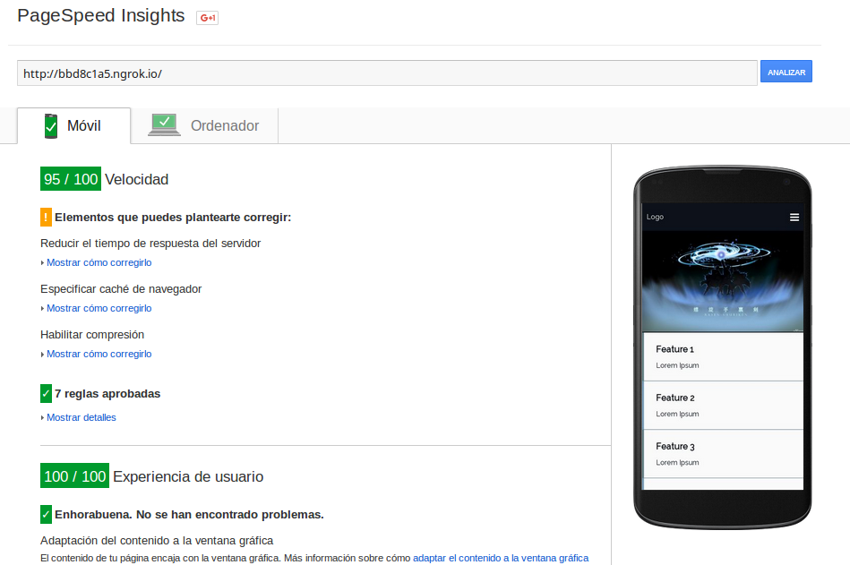
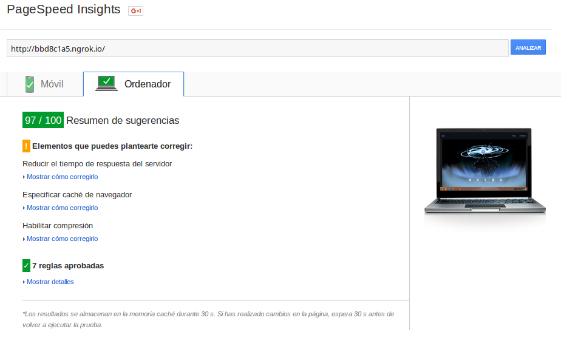

# landing-starter

This is a landing page starter. It includes:

  - Illustrate responsiveness with a navbar, image and feature blocks. Using flexbox.
  - Font Awesome
  - Stylus + Nib
  - Gulp tasks for development and distribution
  - Browserify: lazy loads external css, on *src/js/load-css*
  - No JS plugins. Just vanilla JS.

## gulp tasks

### default

```bash
gulp
```
Builds project on *./build* folder. Watches for changes and livereload. Serves on localhost:8000,

### dist
```bash
gulp dist
```

Builds and optimizes project, on ./dist folder.

## Google insights

Tested using ngrok (no server compression).


---

